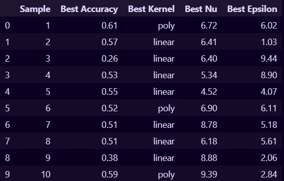
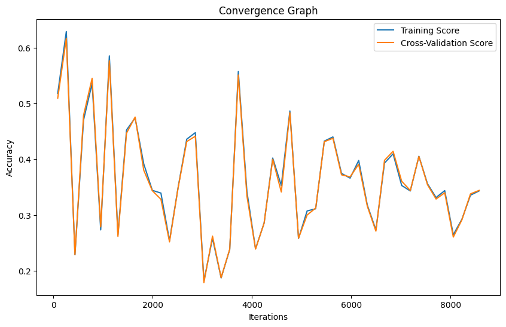

# Parameter Optimization of SVM

## Introduction

Support Vector Machine (SVM) is a powerful algorithm widely used for classification tasks. Parameter optimization plays a crucial role in enhancing SVM's performance, contributing to improved accuracy and efficiency in solving classification problems.

## About Parameter Optimization

Parameter optimization involves selecting the most suitable configuration of parameters for an algorithm to achieve optimal performance. It aims to fine-tune the algorithm by adjusting key parameters such as kernel, C, and gamma.

## Optimization Approach

In this project, parameter optimization is performed using a Fitness Function. This approach aims to find the optimal values for the following parameters:

- **Nu (C):** Controls the number of support vectors used in the model.
- **Kernel:** Specifies the kernel function used in the SVM algorithm.
- **Epsilon (Gamma):** Determines the margin of error allowed in the SVM algorithm.

## Dataset

The dataset used in this project is sourced from the UCI Machine Learning Repository. It contains a total of 13611 instances with 17 attributes.

Dataset Source: [Dry Bean Dataset](https://archive.ics.uci.edu/ml/datasets/Dry+Bean+Dataset)

## Result Analysis

The parameter optimization process yields the following results:

### Result Table

### Result Graph

## Conclusion

From the result graph, it can be observed that the model is well-trained, as indicated by the minimal gap between the training and cross-validation curves. Among the samples analyzed, Sample 1 achieved the highest accuracy of 0.61, with the following parameters:
- Kernel: Poly
- Nu: 6.72
- Epsilon: 6.02

This indicates successful parameter optimization, leading to improved SVM performance for classification tasks.

